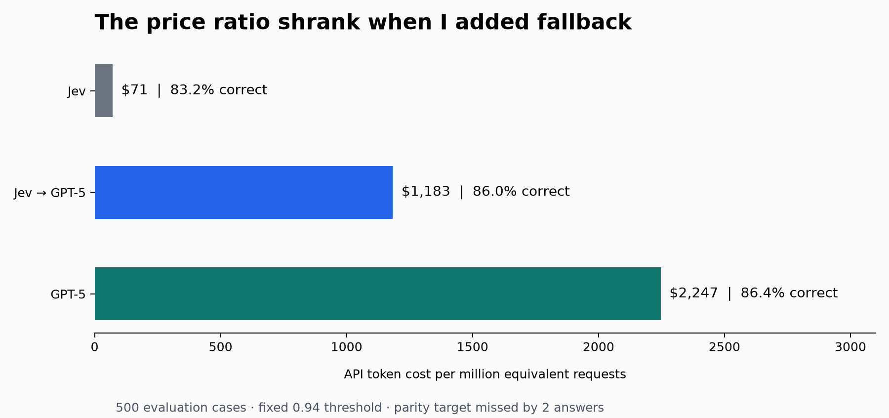
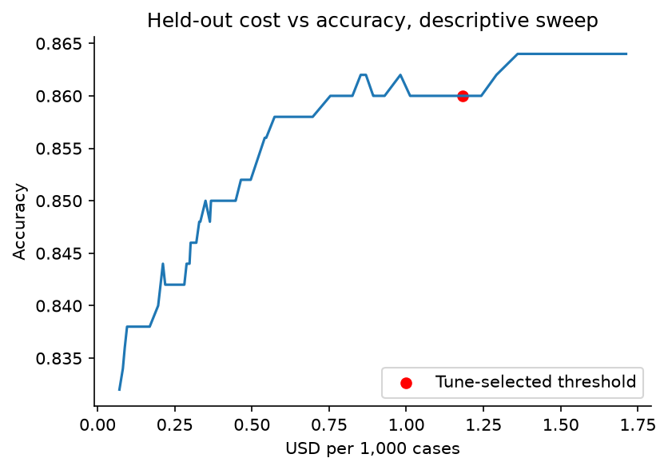

# Jev vs. GPT-5

## Conclusion: what did I trade for the lower bill?

**My cascade missed its predefined accuracy target by two answers out of 500.** My earlier naming experiment also failed its controls; I am not making its intended attribution claim. The useful result here is the measured cost–accuracy trade-off:

| Option | Accuracy on 500 evaluation cases | API cost per million equivalent requests | Trade-off versus GPT-5 |
|---|---:|---:|---|
| GPT-5 alone | 86.4% | $2,246.57 | Baseline |
| Jev alone | 83.2% | $70.88 | About 32× lower cost; 3.2 percentage points lower accuracy |
| Jev with GPT-5 fallback | 86.0% | $1,183.05 | 1.90× lower cost; 0.4 percentage points lower accuracy |

**Using Jev alone reduced API cost by about 96.8%, with 16 fewer correct answers out of 500. Adding GPT-5 fallback reduced cost by 47.3%, with two fewer correct answers.** That is the trade-off I observed. I did not establish equivalent accuracy, reliable production performance, or a universal savings multiplier.

[TypeSafe's homepage](https://typesafe.ai/) currently advertises **444.6× cheaper**, qualified as being based on workflows for System One tasks (checked 21 September 2026). That is a vendor workflow claim, not a verified 100× claim against GPT-5 on this dataset. My experiment uses a different workload and does not directly reproduce or refute that advertised comparison.

TypeSafe's [evaluation explanation](https://typesafe.ai/blog/introducing-system-one-models-and-jev) says its LLM wrapper requests structured decisions with probabilities, which adds cost compared with decisions alone. Here, GPT-5 returned one intent label, while Jev returned a choice, probabilities and confidence. That difference helps explain why these are different comparisons; this study does not isolate how much of the gap it explains. The measured 32× ratio is **API cost per classification**, including recorded token usage, not a claim that tokens themselves are 32× cheaper.

My question is narrower: **how much does Jev save against a pinned GPT-5 configuration on the same classification questions, and how many additional label errors come with that saving?**

On these questions, the answer was about **32× lower cost for Jev alone**, or **1.9× lower cost after adding fallback to recover most of the observed accuracy gap**. These measurements come from offline routing over actual API responses on one reused public benchmark. Whether either option is acceptable depends on the application's error tolerance and needs fresh workload-specific validation.

## What I tested

I wanted to measure the difference between a cheap classification call and a cheap system. I let Jev handle questions it scored confidently and used GPT-5 for the rest.

The detail that changed the cost calculation was the fallback workload: the questions I sent to GPT-5 were **41% more expensive than its average question**.

Here are the requests, measurements, and code behind those numbers.



*Study date: 20 September 2026 UTC. Prices are the recorded study rates. This is a descriptive follow-up on reused public cases, not a production benchmark.*

## I started with a task I could score

The task was single-label banking-intent classification with 77 allowed labels. Each input contained a customer message; the expected output was one intent identifier. Examples of labels include `card_arrival`, `card_delivery_estimate`, and `lost_or_stolen_card`.

I sampled 1,000 cases without replacement from the public Banking77 test split, using seed `20260920`. The first 500 sampled cases were tuning data; the remaining 500 were evaluation data. The evidence records the source revision, file checksum, sample indices, original text, gold labels, and split assignment. The audit found no source-index overlap or duplicate text across the two halves.

The source was **PolyAI's original Banking77 release**: its original 3,080-row test CSV, with label metadata from `PolyAI/banking77`. The separately maintained `mteb/banking77` distribution has 3,076 test rows at the revision checked on 21 September 2026. An exact text-and-label comparison found all 1,000 study examples unchanged in that distribution. The [source comparison](../docs/BANKING77_PROVENANCE.md) records both revisions, row counts and checksums. This remains an evaluation on the frozen original-PolyAI sample, not an MTEB leaderboard evaluation.

| Setting | Recorded configuration |
|---|---|
| Jev | `jev-1.13.0` |
| GPT-5 | `gpt-5-2025-08-07` |
| GPT-5 reasoning | `medium` |
| GPT-5 completion cap | 4,096 tokens, including reasoning |
| GPT-5 endpoint | Chat Completions |
| Output contract | One bare intent label |
| Criteria order | Fixed, identical across cases |
| Threshold grid | 0.00 through 1.00, in steps of 0.01 |
| Escalation rule | Jev confidence strictly less than threshold |

For the GPT-5 follow-up, I reused the original 1,000 Jev responses and collected 1,000 new GPT-5 responses with the original LLM prompt unchanged, using concurrency four. There were no HTTP errors, retries, invalid output labels, model-version mismatches, or truncated GPT-5 completions. All 1,000 completions ended with `finish_reason="stop"`.

An [earlier comparator](../appendix/mini_baseline.json), `gpt-4.1-mini-2025-04-14`, scored 74.2% on the same evaluation half. GPT-5 scored 86.4%. Comparator choice materially changed the measured trade-off; the earlier mini comparison does not stand in for a stronger model.

Because the sample and Jev outcomes were already known, this is a **descriptive follow-up on reused cases**, not a fresh blind replication. GPT-5 settings were committed before new inference. Its evaluation calls began only after tuning predictions were collected and thresholds saved.

## I ran both models. I replayed the routing policy offline.

Every study item had an actual Jev response and an actual GPT-5 response. For analysis, I chose which recorded answer the routing policy would return.

This permits exact per-item scoring of that policy on the collected responses. It does not measure a deployed pipeline's queueing, connection handling, operational failure policy, or end-to-end latency. In production, GPT-5 would be called only after Jev chose to escalate. In this experiment, GPT-5 was called on every item so that the all-GPT-5 baseline and alternative policies could be evaluated.

GPT-5 saw the original message and the allowed intent labels. It did **not** see Jev's prediction, confidence, or probability distribution. This was independent fallback classification, not a second model reviewing the first model's reasoning.

The evaluation policy comes down to this choice. The full [per-item accuracy and cost calculation](reproduce.py#L8-L20) is included in the repo:

```python
def replay(item, tau):
    if item["jev_confidence"] < tau:
        return item["gpt5_prediction"]
    return item["jev_prediction"]
```

If I implemented the same gate as a live pipeline, its control flow would be:

```python
def route(text, jev_classifier, gpt5_classifier, tau=0.94):
    # Illustrative synchronous control flow, not the measured deployment.
    # Callbacks must validate the pinned model and response contract.
    jev = jev_classifier(text)
    if jev["confidence"] < tau:
        return gpt5_classifier(text)
    return jev["choice"]
```

The value 0.94 is a measured setting for this specific experiment, not a portable production default. The live sketch also omits timeout handling, operational fallback rules, logging, and task-specific safety constraints.

## The actual requests

The following snippets use evaluation item `505`, whose actual customer text was:

> I need my card now!

### Jev request

The collected request went to `POST https://api.typesafe.ai/v1/systemone`. The structure below is executable Python that reconstructs the request with the complete original 77-label criteria dictionary:

```python
import json
from pathlib import Path

run = Path("data/cascade-20260920T135930-b9ae3c81")
criteria = json.loads((run / "criteria.json").read_text())

jev_request = {
    "model": "jev-1.13.0",
    "state": "I need my card now!",
    "questions": {
        "decision": {
            "type": "choice",
            "instructions": "Which banking intent does this customer message express?",
            "criteria": criteria,
        }
    },
}
```

Relevant fields from the actual response were:

```json
{
  "choice": "card_arrival",
  "confidence": 0.4
}
```

This is a response excerpt, not the complete response schema. The full request, probabilities, model field, and usage are attached in [the request](examples/fallback_corrects_jev_request.json) and [the response](examples/fallback_corrects_jev_response.json).

### GPT-5 request

The corresponding request went to `POST https://api.openai.com/v1/chat/completions`:

```python
prompt = (
    "Which banking intent does this customer message express?\n"
    "Reply with the bare intent name and nothing else.\n"
    "Allowed intents:\n"
    + "\n".join(f"{key}: {value}" for key, value in criteria.items())
    + "\nCustomer message:\nI need my card now!"
)

gpt5_request = {
    "model": "gpt-5-2025-08-07",
    "messages": [{"role": "user", "content": prompt}],
    "reasoning_effort": "medium",
    "max_completion_tokens": 4096,
}
```

GPT-5 returned `card_delivery_estimate`, matching the dataset label. Since Jev's confidence was below 0.94, the replayed cascade used GPT-5's answer. The [full GPT-5 request](examples/fallback_corrects_llm_request.json) and [response](examples/fallback_corrects_llm_response.json) preserve the exact prompt and token usage.

Authentication headers are not part of the saved evidence. No credentials are included in the article package. No new API calls are necessary to inspect or reproduce the reported analysis.

## I picked the threshold before the evaluation calls

For each threshold on the fixed grid, I computed tuning accuracy by taking Jev's answer above the gate and GPT-5's answer below it. The parity threshold was the **lowest threshold whose tuning accuracy equaled or exceeded all-GPT-5 tuning accuracy**. A separate peak-accuracy selection used the lowest threshold to break ties.

Both selected **0.94**. At that threshold, tuning accuracy was 81.8%, matching GPT-5's 81.8%. The selection was recorded before the first evaluation request. The evaluation sweep is available for descriptive inspection, but was not used to replace the selected threshold.

Confidence exactly equal to 0.94 stays with Jev. The original rule is strict `<`, not `<=`. More generally, even the largest grid threshold, 1.00, retains confidence-1.00 answers; that grid does not necessarily contain an all-GPT-5 policy.

Jev confidence is treated as a routing score. It is not assumed to mean “probability this answer is correct.” The vendor's concentration-based description does not specify a correctness-probability interpretation. Useful error ranking and calibrated correctness probabilities are different properties.

## The fallback fixed 14 answers and left a two-answer gap

The evaluation results were:

| Method | Correct / 500 | Accuracy | API cost per million equivalent requests |
|---|---:|---:|---:|
| Jev alone | 416 | 83.2% | $70.88 |
| Original GPT-4.1-mini | 371 | 74.2% | $316.05 |
| GPT-5 alone | 432 | 86.4% | $2,246.57 |
| Jev → GPT-5 at frozen threshold | 430 | 86.0% | $1,183.05 |

The cascade **did not meet the predefined empirical parity criterion**. The two-answer difference does not by itself demonstrate underlying inferiority, but it also cannot establish equivalence or non-inferiority. No statistical non-inferiority margin was preregistered.

The routing breakdown explains the aggregate:

| Evaluation subset | Cases | Jev correct | GPT-5 correct | Answer used |
|---|---:|---:|---:|---|
| Confidence ≥ 0.94 | 325 | 303 | 305 | Jev |
| Confidence < 0.94 | 175 | 113 | 127 | GPT-5 |

Thus:

```text
Cascade accuracy = (303 + 127) / 500 = 86.0%
```

Using GPT-5 on the escalated subset produced a net gain of 14 correct answers relative to Jev alone. Retaining Jev on the other subset produced two fewer correct answers than all-GPT-5. Across the full evaluation set, the cascade was uniquely correct on zero cases where GPT-5 was wrong; GPT-5 was uniquely correct on two cases where the cascade was wrong.

The escalated subset was substantially harder: GPT-5 accuracy there was 72.57%, compared with 93.85% on the retained subset. It would therefore be incorrect to estimate fallback correctness as `175 × overall_GPT5_accuracy`.

Descriptive 95% Wilson intervals for the observed accuracies are 79.7–86.2% for Jev, 83.1–89.1% for GPT-5, and 82.7–88.8% for the cascade. These intervals assume item-sampling conditions and do not address production shift or repeated-inference variability. They are not a paired equivalence test.

## The fallback rate was 35%. The bill was not.

At the recorded study rates, GPT-5 input tokens cost $1.25 per million, cached input $0.125, and output $10. Reasoning tokens are included in `completion_tokens`, so they must not be charged a second time. Jev was priced at $0.042 per million input tokens.

I priced every response separately. The [reproduction code](reproduce.py#L39-L47) uses the same accounting:

```python
def gpt5_cost(usage):
    cached = usage["prompt_tokens_details"]["cached_tokens"]
    uncached = usage["prompt_tokens"] - cached
    return (
        uncached * 1.25
        + cached * 0.125
        + usage["completion_tokens"] * 10.0
    ) / 1_000_000
```

The mean GPT-5 cost over all evaluation items was **$0.00224657**. Among escalated items, it was **$0.00317763**, approximately **41.4% higher**. The study observed zero cached-input tokens on the evaluation calls.

For a fixed gate, the relevant equation is:

```text
Mean cascade cost
  = mean Jev cost over all items
  + escalation fraction × mean GPT-5 cost among escalated items

  = $0.000070884 + 0.35 × $0.003177629
  = $0.001183054 per request
```

An estimate using overall average GPT-5 cost would give roughly $857 per million requests. The actual per-item calculation gives **$1,183 per million**. Selecting difficult requests changes the cost distribution as well as the accuracy distribution.

The policy therefore used 52.66% of the all-GPT-5 API cost, a **47.34% reduction** or **1.90× cost ratio**. Jev alone had a **31.69× cost ratio**, but with lower observed accuracy. Those ratios answer different questions.

My 1,000 new GPT-5 study calls consumed **$2.28485625** in token charges, excluding the separate synthetic smoke call. The per-million figures extrapolate from recorded per-item usage; I did not execute a million requests. Total GPT-5 reasoning usage was 118,848 tokens, with reasoning tokens on 827 calls. The maximum was 1,152 reasoning tokens in a call, and no completion exhausted the cap.



The red point is the threshold selected on tuning data. The rest of this evaluation curve is descriptive; it was not used to select a replacement threshold.

## I also had to be precise about “wrong”

All accuracy calculations use exact agreement with the dataset's gold intent. They do not independently judge whether an answer would satisfy a customer or trigger an acceptable product action.

Three attached examples illustrate different outcomes. They are the first evaluation cases in sample order satisfying each listed pattern, selected after analysis for explanation, not as representative estimates:

1. **Fallback corrects a label mismatch, item 505.** “I need my card now!” Jev chose `card_arrival` at confidence 0.40. GPT-5 chose the gold label `card_delivery_estimate`.
2. **A high-confidence error survives, item 520.** The customer described a stolen card and money already withdrawn. The gold label was `cash_withdrawal_not_recognised`. Both models chose `lost_or_stolen_card`; Jev confidence was 0.96, so the cascade retained it.
3. **Both models miss the label, item 529.** “What are the fees to get a physical card?” Both chose `get_physical_card`, while the gold label was `order_physical_card`. Jev confidence was 0.87, so escalation did not correct the mismatch.

The latter examples contain overlapping intent cues or closely related labels. That observation does not authorize relabeling the benchmark after seeing results. It does explain why production evaluation must connect label errors to the application's actual action and error costs.

Exact inputs and outputs for all three cases are in [the examples index](examples/index.json).

## What I would actually budget for

| Latency, milliseconds | p50 | p95 | p99 |
|---|---:|---:|---:|
| Historical Jev calls | 531 | 633 | 703 |
| New GPT-5 calls | 1,713 | 4,785 | 8,916 |
| Simulated serial cascade | 566 | 4,829 | 9,487 |

For escalations, simulated latency is the sum of the separately observed Jev and GPT-5 latencies. Retained cases use Jev latency alone. These are quantiles over per-item totals, not sums of independently computed percentile values.

Jev calls were historical and sequential; GPT-5 calls used concurrency four. Network conditions, connection reuse, scheduling, load, and service behavior were not controlled contemporaneously. The table is descriptive. It is not evidence that a deployed cascade has these exact latency percentiles. It also shows why a fast common path can coexist with a slower tail: escalated requests pay for both calls in sequence.

API token cost excludes application hosting, monitoring, retries in a production failure distribution, engineering maintenance, human review, and the consequences of errors. With N annual requests and M in additional annual operating cost, the observed-rate gross saving would imply:

```text
Annual net saving before differences in error consequences
  = N × $0.001063516 − M
```

| Assumed additional annual operating cost | Break-even annual requests |
|---|---:|
| $10,000 | 9.4 million |
| $30,000 | 28.2 million |
| $100,000 | 94.0 million |
| $250,000 | 235.1 million |

These are scenarios, not measured operating costs. They assume the observed workload and rates persist, and do not satisfy a quality constraint that the evaluation failed. If the application cannot accept the relevant error trade-off, a positive API saving does not make the policy acceptable.

## What I cannot claim from this experiment

My earlier naming experiment could not separate the proposed effect from its controls. Changing the GPT comparator does not repair that experiment. I have kept the formal verdicts and protocol in the repository appendix, rather than treating those observations as a demonstrated naming vulnerability.

The Jev collector initially rejected 50 successful responses because rounded probabilities summed to 0.99 instead of 1.00. A documented offline parser correction recovered the predictions and confidence from the saved bodies. It preserved the original rows and errors, did not normalize probabilities, and did not repeat calls. This is another reason the analysis is labeled descriptive rather than an unqualified confirmatory result.

The routing comparison has further limits:

- One public banking-intent dataset does not establish cross-domain or production performance.
- Reusing a known sample limits the strength of a fresh-validation claim, even with new GPT-5 predictions and a frozen selection procedure.
- A public benchmark may overlap with model training exposure; this study cannot determine whether it does.
- Neither GPT-5 prompting nor its reasoning effort was optimized through a separate search. The unchanged bare-label prompt was the measured comparator configuration.
- I collected one prediction per model per item; repeated-inference variability was not measured.
- Exact-label accuracy weights all errors equally. Fraud-sensitive errors and harmless taxonomy confusions may have very different application costs.
- The threshold is not a guarantee that retained predictions are at least 94% accurate. Their observed accuracy was 93.23%.
- Threshold selection, evidence integrity, and arithmetic checks passing do not reverse the failed held-out parity criterion.

## Applying this result to classification and agent workflows

These numbers are measured operating points for one banking-intent task. Other classification workloads need their own held-out accuracy, error-severity and cost measurements. The roughly 32× lower API cost came with a **3.2-percentage-point accuracy loss relative to GPT-5**. That is an additional classification-error gap, not an absolute 3.2% error rate or a measured tool-call failure rate.

In an agent loop, a wrong tool selection, argument or interpretation can change the state used by later decisions. Errors can propagate, while detection, retries and recovery can also change the outcome and bill. A schema-valid decision does not by itself establish semantic correctness. This study measured neither tool execution nor complete agent runs, and it did not establish a formula mapping its single-step accuracy to long-horizon task success.

An agent evaluation would need complete runs on fresh representative tasks, measuring task success, consequential actions, recovery and retry behavior, total API cost, and end-to-end latency. Cost per successful task matters alongside cost per decision. The confidence threshold and acceptable errors must be selected for that workflow and then evaluated on untouched cases.

For the classification task actually measured, the fallback policy achieved **86.0% accuracy versus GPT-5's 86.4%, at 47.3% lower API cost**. Equivalently, it used **52.7% of the GPT-5 API bill**. These are near-GPT-5 observed results, not demonstrated equivalent accuracy, and they do not establish the same savings in an agent loop.

## What I would test before deploying it

Before deploying this architecture, I would define the quality constraint before tuning: for example, an acceptable accuracy-loss margin and separate limits for high-cost error classes. The present experiment supplies no universal choice for either.

I would use a fresh sample representative of the actual incoming workload, including ambiguous, multi-intent, and out-of-taxonomy messages if those occur in production. Freeze label descriptions and order, the comparator prompt, model versions, pricing assumptions, and the fallback policy. Tune on one subset and evaluate once on untouched cases. Preserve all failures rather than excluding them from accuracy or cost denominators.

Next, I would shadow the actual sequential pipeline. Measure request-level token cost, end-to-end latency, timeout frequency, and the error-handling path. Monitor the retained subset as well as escalations: a model can be confidently wrong, and those errors never reach the fallback under this policy.

If the quality target fails, report that failure. A revised threshold or model configuration requires a new declared experiment and fresh evaluation evidence; it cannot be retroactively presented as the original result.

## Reproduction and attachments

I am publishing an offline reproduction package: the sampled public data, response fields needed to score the GPT-5 comparison, exact sample requests, analysis code, formal protocols, and figures. I removed provider response IDs, account-adjacent metadata, local paths, and private history. The public records are sanitized derivatives, not byte-identical originals; predictions, confidence, probabilities and token usage are preserved. The [release notes](../PUBLIC_RELEASE.md) define that boundary.

[reproduce.py](reproduce.py) is a standalone Python script using only the standard library. It reads the saved response bodies, checks exact model versions and successful completions, reconstructs both split accuracies and per-item token costs, reselects the tuning threshold, and verifies agreement with the frozen threshold and recorded evaluation result. It performs no network calls. It deliberately stops rather than silently handling retries or failed requests that are absent from this particular run.

From the repository snapshot's root, the reproducibility command is:

```bash
python3 article/reproduce.py
```

The verified output is attached as [reproduced_metrics.json](reproduced_metrics.json). The article examples include complete JSON requests and responses, not only the excerpts above.

Primary evidence:

- [Full cascade report](../results/cascade-20260920T135930-b9ae3c81/report.md)
- [Computed summary](../results/cascade-20260920T135930-b9ae3c81/summary.json)
- [Sanitized response records](../data/cascade-20260920T135930-b9ae3c81/attempts.jsonl)
- [Fixed sample and labels](../data/cascade-20260920T135930-b9ae3c81/items.json)
- [Frozen tuning selection](../data/cascade-20260920T135930-b9ae3c81/tune_selection.json)
- [Public release provenance](../appendix/release_provenance.json)
- [Original protocol](../PREREGISTRATION.md) and [GPT-5 follow-up protocol](../PREREGISTRATION_GPT5.md)
- [Formal naming-study verdicts](../appendix/identifier_verdicts.json)

External sources:

- [Banking77 dataset](https://huggingface.co/datasets/PolyAI/banking77), distributed under CC BY 4.0.
- [Casanueva et al., Efficient Intent Detection with Dual Sentence Encoders](https://arxiv.org/abs/2003.04807), 2020.
- [Official OpenAI GPT-5 model documentation and pricing](https://developers.openai.com/api/docs/models/gpt-5). Rates above are the frozen study rates, not a claim about future pricing.
- [Official Chat Completions API reference](https://developers.openai.com/api/reference/resources/chat/subresources/completions/methods/create), including the reasoning-inclusive completion limit.
